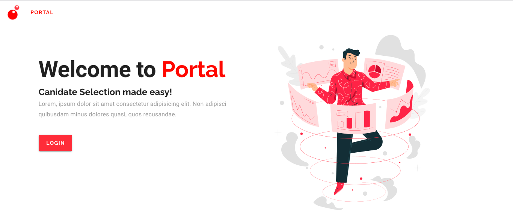

# Portal-Demo
This is a demo candidate selection portal. You can view applicants, leave reviews and generate reports. The frontend was built with Vue.js + Vuetify and the rest api is built with express. For the database i used Postgresql to match your internal DB :). Hope you  enjoy

> [Preview Link](https://temple-portal.herokuapp.com/#/landing?redirect=%2F)



## Overview of API
| Request   | Endpoint                        | Description
|-----------|---------------------------------|--------------------------------
| *POST*    |  `/api/proctor/login`	        |  Login the Proctor
| *POST*    |  `/api/proctor/register`	    |  Register a new Proctor
| *GET*     |  `/api/proctor`               |  Get all Proctors
| *GET*     |  `/api/proctor/:id`           |  Get a Proctor by id
| *GET*     |  `/api/applicant`             |  Get all Applicants
| *GET*     |  `/api/applicant/:id`         |  Get an Applicant by id
| *PUT*     |  `/api/applicant/:id`         |  Update Applicants reviewed status
| *PUT*     |  `/api/applicant/:id/review`  |  Add review to Applicant by id
| *GET*     |  `/api/applicant/:id/comment` |  Get reviews for Applicant by id
| *DELETE*  |  `/api/applicant/:id`         |  Remove Applicant by id


## Project setup
```
git clone https://github.com/ConceptCodes/portal-demo.git
cd portal-demo
yarn install
```

## Run 
```
yarn dev
```
